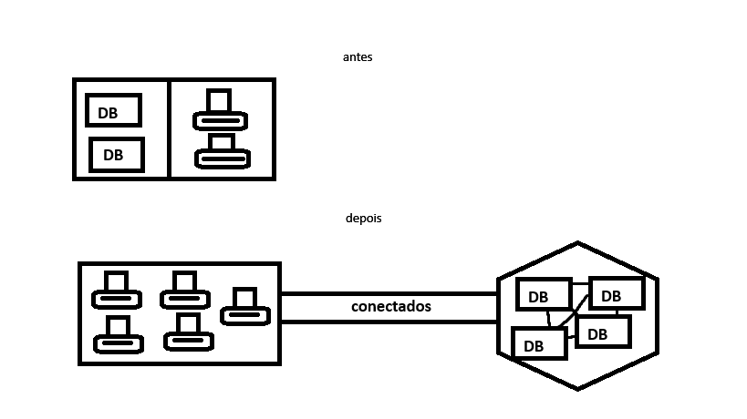

# Declaração de tarefa 1.1: Definir os benefícios da nuvem AWS

# Sumário
- [Introdução](#introdução)
- [Cloud Computing](#cloud-computing)
    - [Tipos de Cloud](#tipos-de-cloud)
    - [Proposta de valor da nuvem AWS](#proposta-de-valor-da-nuvem-aws)
    - [Compreensão dos aspectos econômicos do dimensionamento](#compreensão-dos-aspectos-econômicos-do-dimensionamento)
    - [Compreensão dos benefícios da infraestrutura global](#compreensão-dos-benefícios-da-infraestrutura-global)
    - [Compreensão das vantagens da alta disponibilidade, elasticidade e agilidade](#compreensão-das-vantagens-da-alta-disponibilidade-elasticidade-e-agilidade)

## Introdução

Nesta seção, exploraremos os *benefícios chave da AWS*, abordando desde a sua proposta de valor, que inclui *escalabilidade e inovação*, até aspectos econômicos e técnicos, como a *economia de custos* proporcionada pelo dimensionamento eficiente, a infraestrutura global que garante *alta performance* e a agilidade necessária para atender às *demandas do mercado de forma rápida e eficaz*.

## Cloud Computing

Antigamente, as empresas precisavam manter bancos de dados locais e servidores físicos, o que demandava altos custos e manutenção constante. Com a evolução da computação em nuvem, o uso de servidores remotos tornou-se muito mais comum devido à praticidade e eficiência. A computação em nuvem permite que os dados sejam armazenados e acessados remotamente, liberando recursos locais e proporcionando maior flexibilidade e escalabilidade.

### Tipos de cloud
* IAAS (**Infrastructure as a Service**) - Fornece infraestrutura de TI virtualizada, como servidores, armazenamento e redes, que podem ser provisionados e gerenciados pela internet. Exemplo: Amazon EC2.
* PAAS (**Platform as a Service**) - Fornece uma plataforma que permite aos desenvolvedores criar, testar e implantar aplicativos sem gerenciar a infraestrutura subjacente. Exemplo: AWS Elastic Beanstalk.
* SAAS (**Software as a Service**) - Fornece aplicativos de software pela internet, eliminando a necessidade de instalação e manutenção local. Exemplo: Google Workspace.
* HAAS (**Hardware as a Service**) - Fornece hardware físico como um serviço, permitindo que as empresas aluguem equipamentos em vez de comprá-los. Exemplo: Equipamentos de rede alugados.
* XAAS (**Anything as a Service**) - Refere-se a uma ampla variedade de serviços que podem ser entregues pela internet, abrangendo qualquer coisa que possa ser oferecida como um serviço. Exemplo: Backup as a Service (BaaS), Database as a Service (DBaaS).
* Nuvem pública (**Public Cloud**) - Infraestrutura de nuvem que é provisionada para uso aberto pelo público em geral. Os recursos são de propriedade e operados por um provedor de serviços de nuvem terceirizado, como AWS, Microsoft Azure ou Google Cloud. Exemplo: Amazon Web Services (AWS).
* Nuvem privada (**Private Cloud**) - Infraestrutura de nuvem operada exclusivamente para uma única organização. Pode ser gerenciada internamente ou por terceiros e hospedada internamente ou externamente. Exemplo: Nuvem privada de uma empresa que utiliza VMware.
* Nuvem comunitária (**Community Cloud**) - Infraestrutura de nuvem compartilhada por várias organizações e suportando uma comunidade específica que tem interesses em comum (por exemplo, missão, requisitos de segurança, políticas). Pode ser gerenciada internamente ou por terceiros e pode ser hospedada internamente ou externamente. Exemplo: Nuvem comunitária para instituições governamentais.
* Nuvem híbrida (**Hybrid Cloud**) - Combinação de duas ou mais infraestruturas de nuvem (pública, privada ou comunitária) que permanecem entidades únicas, mas são unidas por tecnologia padronizada ou proprietária que permite portabilidade de dados e aplicativos. Exemplo: Uma empresa que utiliza AWS para cargas de trabalho públicas e uma nuvem privada para dados sensíveis.

### Proposta de valor da nuvem AWS

A AWS (Amazon Web Services) oferece uma solução completa de serviços em nuvem, com foco em escalabilidade, flexibilidade e inovação. Os principais benefícios incluem: 

1. Escalabilidade: A AWS permite que você _aumente ou reduza recursos_ de acordo com as necessidade do negócio. Evitando gastos excessivos com a infraestrutura.

2. Flexibilidade: Oferece uma ampla _gama de serviços que podem ser personalizados_ para atender a _diferentes necessidades_ empresariais.

3. Inovação: A AWS disponibiliza uma série de ferramentas avançadas, como inteligência artificial, machine learning e Big Data, para ajudar as empresas a inovar mais rapidamente.

Dessa forma, em comparação com soluções tradicionais de TI, a AWS oferece _redução de custos e agilidade_. Em vez de investir pesadamente em hardware e infraestrutura local, você pode pagar apenas pelo que usar e ter acesso a serviços de ponta. 

### Compreensão dos aspectos econômicos do dimensionamento

* ***Economia de custos:*** A economia de custos, no contexto de Cloud Computing, permite uma utilização otimizada dos recursos, reduzindo a necessidade de investir em hardware físico e oferecendo maior flexibilidade para ajustar a infraestrutura conforme a demanda.

* Exemplos de **otimização de custos** na AWS:
    * **Escalabilidade sob demanda:** Quando a demanda aumenta, você pode adicionar recursos de maneira rápida e eficiente, sem necessidade de compras antecipadas ou custos fixos.
    * **Modelos de pagamento por uso:** Você paga pelos serviços consumidos, sem custos antecipados ou de manutenção de infraestrutura, otimizando o orçamento de TI.

* Exemplo na prática: Empresas que migram para a AWS frequentemente experimentam uma redução de custos significativa, já que o modelo de ***pague pelo uso*** permite **ajustar recursos** para atender exatamente à **necessidade do momento**. Por exemplo, uma empresa pode precisar de maior capacidade de computação **apenas durante períodos de pico**, economizando durante o resto do tempo.

### Compreensão dos benefícios da infraestrutura global

* ***Infraestrutura Global:*** A infraestrutura global da AWS oferece uma **rede distribuída** de data centers, proporcionando ***baixa latência e alta disponibilidade***. Isso garante uma ***performance otimizada e resiliência, com backup e recuperação de desastres*** em diversas regiões. 

### Compreensão das vantagens da alta disponibilidade, elasticidade e agilidade

- **Alta Disponibilidade**
- ***Elasticidade***
- ***Agilidade***

A AWS proporciona **alta disponibilidade** através de várias *zonas de disponibilidade* (AZs), **elasticidade** para *ajustar automaticamente os recursos* conforme a demanda e **agilidade** para *lançar novos produtos ou serviços rapidamente*. 
